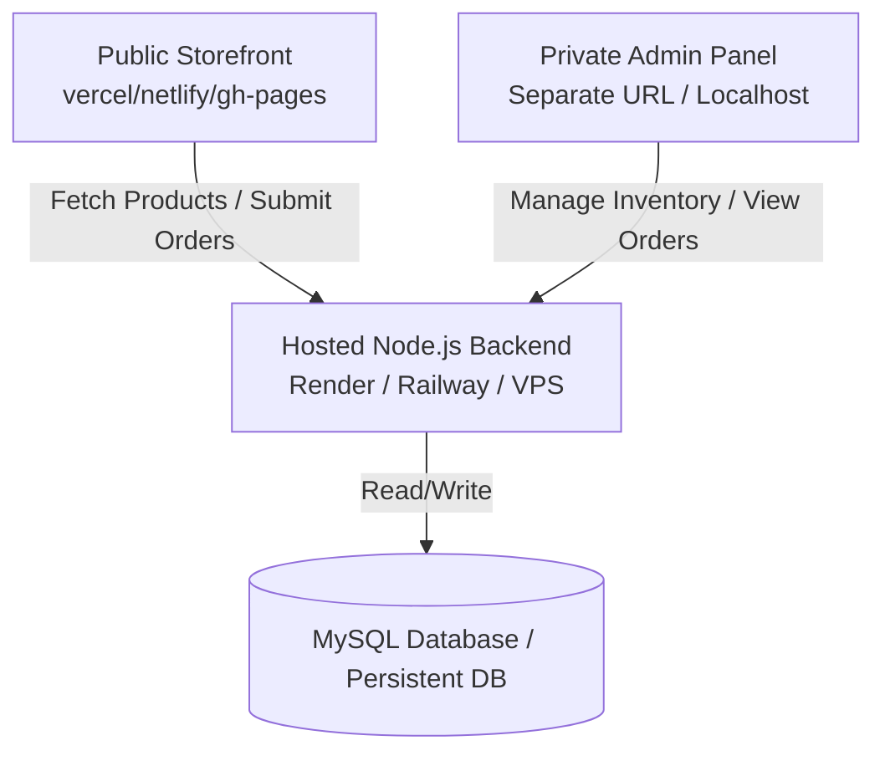

# croch_etgallery — Dual-Deployment Hosting Guide

This guide details how to separate the **Public Storefront** (for your client) and the **Private Admin Dashboard** (for you) using a shared **Hosted Backend API**.

---

## 🗺️ System Architecture



---

## 🛠️ Step-by-Step Hosting Procedure

### Step 1: Deploy the Shared Backend API

The backend manages the database and handles REST API requests from both the frontend and the admin panel.

1. **Choose a Host**:
   - **Render** (Free tier available for Web Services).
   - **Railway** or **Render** are recommended for simple Node.js APIs.
2. **Set up a Database**:
   - Since server deployments on platforms like Render have ephemeral filesystems, using the local `db.json` file means **changes will be lost whenever the server restarts**.
   - Use a persistent **MySQL Database** (e.g., PlanetScale, Aiven, or a database provided by your hosting package).
3. **Environment Variables (.env)**:
   Add these environment variables in your hosting provider's dashboard:
   ```ini
   PORT=10000
   DB_HOST=your-database-host
   DB_USER=your-database-user
   DB_PASSWORD=your-database-password
   DB_NAME=your-database-name
   JWT_SECRET=your-strong-secret-key-change-this
   ```
4. **Update CORS in `backend/server.js`**:
   Ensure both the public store URL and your private admin URL are allowed:
   ```javascript
   const corsOptions = {
     origin: [
       "https://your-client-store.vercel.app", // Public store
       "https://your-private-admin.vercel.app", // Private admin (if hosted)
       "http://localhost:8080",                 // Local development
       "http://127.0.0.1:8080"
     ],
     optionsSuccessStatus: 200
   };
   ```

---

### Step 2: Deploy the Public Storefront (Client Site)

To prevent public users or the client's customers from accessing the admin login:

1. **Prepare the Public Repository**:
   - Create a build of the project without the `admin/` folder.
   - **How to automate this**: Update the `scripts/build.js` to exclude `'admin'` from `directoriesToCopy` for public releases:
     ```javascript
     // Remove 'admin' from directoriesToCopy in scripts/build.js
     const directoriesToCopy = ['css', 'js', 'images', 'components']; 
     ```
   - Run `npm run build`.
2. **Host the Public Build**:
   - Upload the contents of the generated `build/` folder to your client's static hosting platform (e.g., Vercel, Netlify, or Hostinger Public HTML).
3. **Configure API URL**:
   - Update `js/config.js` so the production fallback points to your hosted backend:
     ```javascript
     API_BASE: isLocal ? "http://localhost:5000" : "https://your-backend-api.onrender.com",
     ```

---

### Step 3: Deploy/Run Your Private Admin Dashboard

Since the admin panel is completely token-authorized (using JWT), you can run it from anywhere. You have two options:

#### Option A: Run it completely locally (Recommended for maximum security)
You do not need to host the admin files online at all. You can keep the `admin/` directory locally on your computer.
1. Open `admin/js/config.js` and set the production `API_BASE` directly to your live backend:
   ```javascript
   // Set API_BASE to point to your live hosted backend
   API_BASE: isLocal ? "http://localhost:5000" : "https://your-backend-api.onrender.com",
   ```
2. Start your local dev server: `npm run serve:dev`.
3. Open `http://localhost:8080/admin/login.html` to manage the live store database securely.

#### Option B: Host it on a private subdomain / URL
If you want to access the admin panel on the go (e.g., on your phone):
1. Deploy **only** the `admin/` folder contents to a separate private hosting project (e.g., `admin-my-croch_etgallery.vercel.app`).
2. Secure the URL by not linking to it from the public storefront.
3. Configure `admin/js/config.js` to point to the live backend URL:
   ```javascript
   API_BASE: isLocal ? "http://localhost:5000" : "https://your-backend-api.onrender.com",
   ```

---

## ❓ Open Questions for You

> [!IMPORTANT]
> 1. **Do you have a remote MySQL database ready**, or would you like assistance setting up a free remote MySQL database?
> 2. **Would you like me to modify `scripts/build.js` now** to separate the admin files from the public storefront build automatically?
